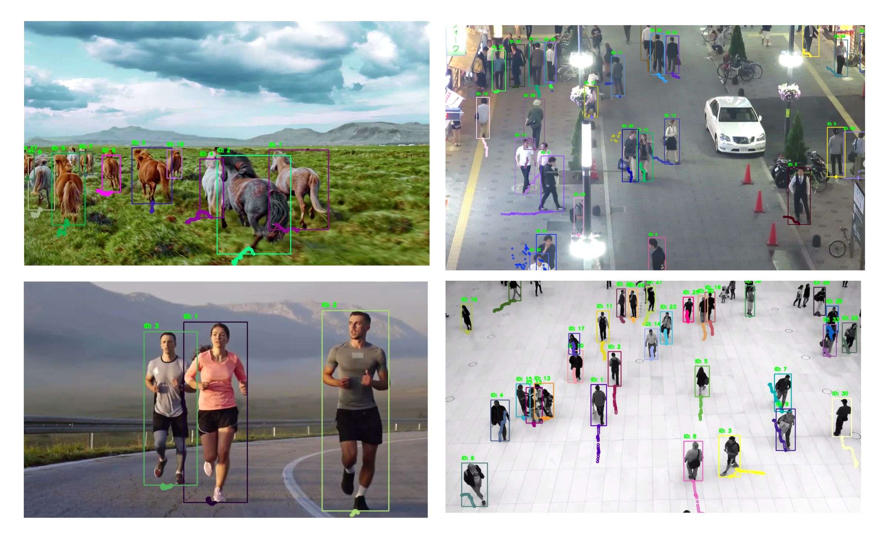
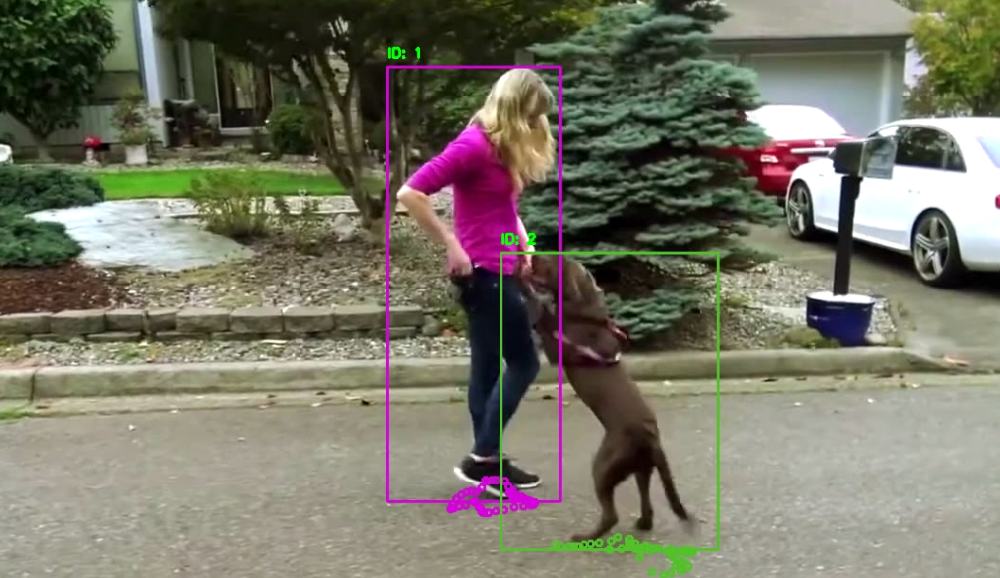
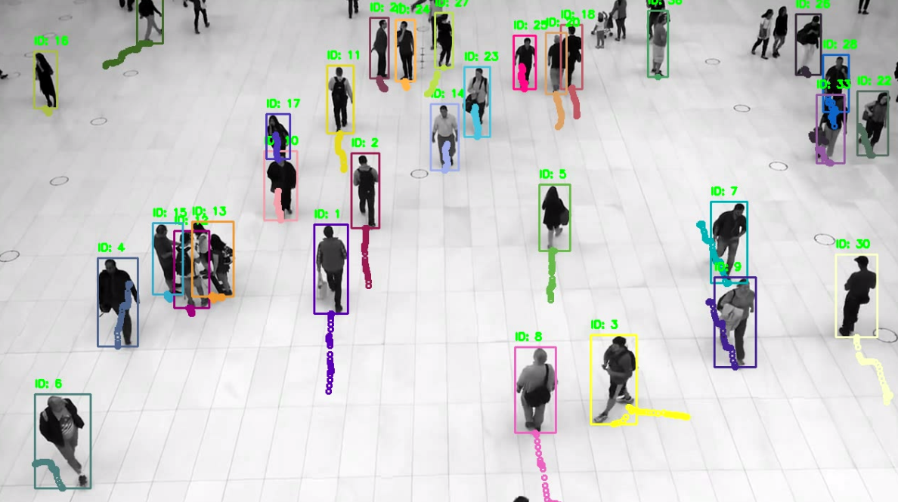
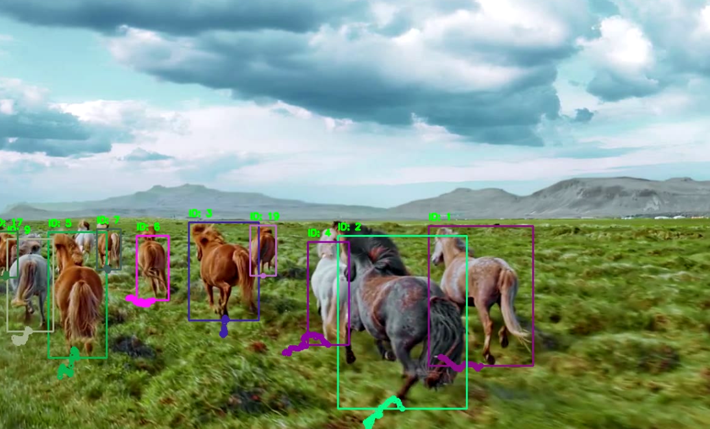
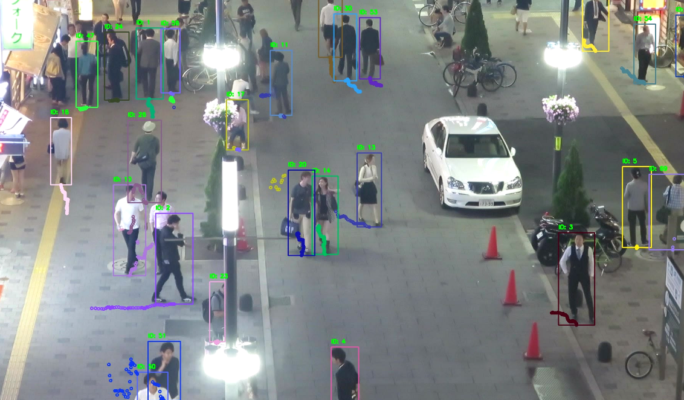
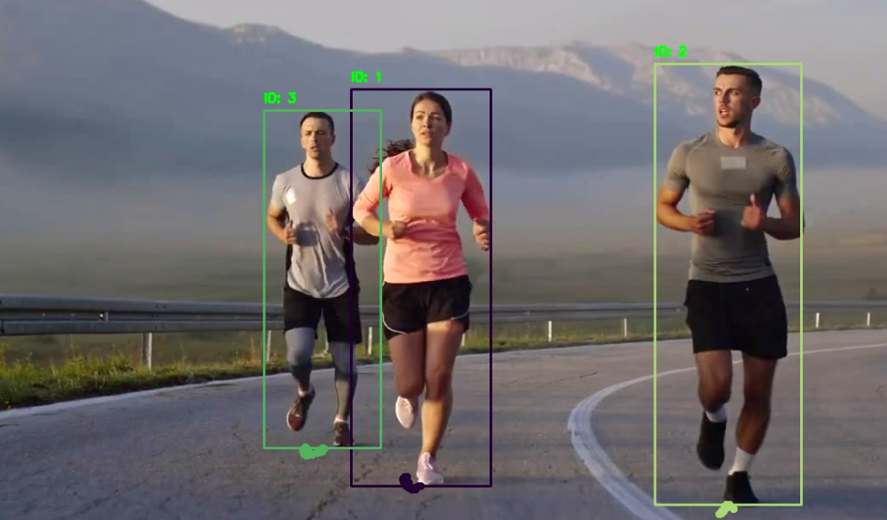

# MultiObjectTracking-YOLO-NAS-DeepSORT

<p align="center">

</p> 

## Project Description:
This repository implements a robust online real-time multi-object tracking (MOT) system using a tracking-by-detection scheme. In the tracking-by-detection approach, upon receiving a new frame, objects are detected using an object detector. Based on a similarity metric, the newly detected bounding boxes are then assigned to existing tracks, or new tracks are formed.

Our implementation combines two powerful techniques: ```YOLO-NAS``` for object detection and ```DeepSORT``` for object tracking. This fusion creates an efficient and accurate framework for tracking objects in real-time video streams.

```Yolo-NAS``` is a fast and accurate object detector based on the Yolo family, enhanced by Neural Architecture Search (NAS). It comprises three versions—small, medium, and large—offering varying trade-offs between accuracy and model parameters. All three versions can be selected in our code. The pre-trained weights of the models were obtained through training on the COCO dataset, which includes 80 classes. However, if there is a need to detect and track objects not supported by COCO, the pre-trained weights can be replaced.

```DeepSORT``` Object Tracking utilizes Kalman filters and deep learning embeddings to associate detected objects in a new frame with the objects in the previous frames. It is a fast, robust, and simple tracker. 

**Important**: The DeepSORT deep learning embeddings are provided by a network that has been trained for a person re-identification task. However, since the Kalman filter heavily influences the assignment of weights to newly detected objects, when the code was used to track objects other than humans, the results were satisfactory in many cases.

## How to Use:

1- Clone this repository:
```
git clone https://github.com/farhad-dalirani/MultiObjectTracking-YOLO-NAS-DeepSORT.git
```
2- Install requirments:
```
For YOLO-NAS, installing PyTorch and supergradients is required. Additionally, for 
DeepSort, we used the implementation available at (https://github.com/ZQPei/deep_sort_pytorch). 
To install the required packages, please refer to their readme file 
on their GitHub page or in the deep_sort_pytorch_master folder. The DeepSort 
implementation is identical to the original repository; however, we have commented out 
the lines related to fast-reid since we do not use it.
```
3- Download/provide input vidoes/images-sequence:
```
The code takes a sequence of images and video as input.
If you wish to use your own input, place the new video or sequence of images in the 'inputs' 
folder or any other location. To test it on the data I used, open the 
'inputs/data-link.txt' file containing links to various data. Download each 
one that you want from the provided link, and place in its corresponding 
folder within the 'inputs' folder.
```
4- Appropriate config file:
```
For the input that I tested the code on, there are configuration
files for each of them in the 'config_files' folder.
If you want to use it with your own data, you'll need
to create a configuration file similar to them.
A configuration file essentially contains information such as whether 
the input is a video or a sequence of images, its file path,
the YOLO version to use, the objects to consider for tracking,
hyperparameters for DeepSORT, and so on. Finally, put the path of 
the config file in 'config_file_path.json'.
```
5- Run code:
```
python main.py
```

## Demo
[![Watch the video]](readme-files/demo.mp4)

<p align="center">

</p> 
<p align="center">

</p> 
<p align="center">

</p> 
<p align="center">

</p> 
<p align="center">

</p> 


